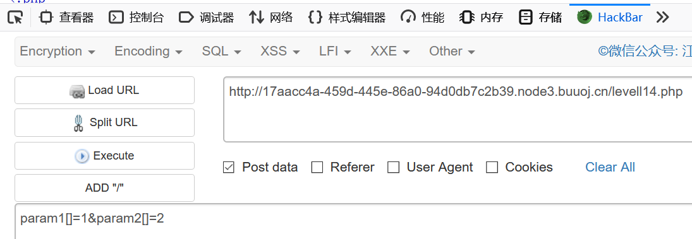

## flag

`flag{1c29754d-33d2-467c-aaa2-dbbd51754d0e}`

## 思路

hint:

1. 打开网页发现只有一个输入框，直观思路就是输入内容然后提交查看结果，发现并没有有用结果。接下来的思路可能就是查看源码/目录遍历/利用burpsuite拦截看是否有有用信息。

2. 本题F12查看源码并没有找到有用信息。

3. 利用burpsuite拦截，发现hint：select * from 'admin' where password=md5($pass,true)

   

   ​       此处就可以考虑SQL注入，最简单的思想是 `'(trash)' or '1(trash)'` 绕过

   ​       即找到一个字符串，md5之后的结果以 `'or'` 开头

   ​	   即预期的效果是：`select * from 'admin' where password='(trash)' or '1(trash)'`

4. md5(string,true) 表示输出结果为16字符二进制格式

   此处提供一个例子，可以作为一种积累：

   ```
      1. content: ffifdyop
      2. hex: 276f722736c95d99e921722cf9ed621c
      3. raw: 'or'6\xc9]\x99\xe9!r,\xf9\xedb\x1c
      4. string: 'or'6]!r,b
   ```

5. 在输入框中输入ffifdyop之后，查看源码，即可发现：

   <script>window.location.replace('./levels91.php')</script>

6. 访问levels91.php，发现提示如下：

   

7. 此处思路为 如何绕过`$a!=$b&&md5($a)==md5($b)`

8. 注意==为php的弱类型比较，不会比较变量类型，此处绕过有两种方法：

   1. 可以考虑利用‘0e’开头跟数字的字符串。即找到两个md5值都是两个0e开头的字符串。

       eg:`QNKCDZO`和`s155964671a`

   2. 数组绕过。因为md5函数不能处理数组，所以会返回Null

      即   若`$a=array("BMW")`;  则  `md5($a)=Null`

      所以可以用两个数组来绕过上面的匹配

      eg:?a[]=1&b[]=2

9. 绕过此处之后，页面的源码中提示访问`levell14.php`

   该页面显示为：

   

10. 此处的绕过条件变为：`$_POST['param1']!==$_POST['param2']&&md5($_POST['param1'])===md5($_POST['param2'])`

    此时md5后的结果变为了强类型比较。按照上面的数组方法仍可绕过该比较条件。

    传递post数据一般用一些插件即可。此处是hackbar。

    

## 总结

- 本题对MD5的使用比较巧妙。
- 首先是最常规的sql注入，但最后的条件经过一次MD5加密，因此需要找到一个字符串经过MD5加密后，hex解码后为'or'1形式，可积累，该字符串即为`ffifdyop`
- 然后是有关MD5的两种比较形式绕过。有关CTF中常用的MD5绕过，可参考：[CTF中常见的MD5漏洞](https://blog.csdn.net/qq_19980431/article/details/83018232)，总结的比较详细。
- 与本题类似的，还有[安洵杯 2019]easy_web和[BJDCTF 2020]ZJCTF，不过如此。这两道题都用MD5漏洞，可以比较练习。

